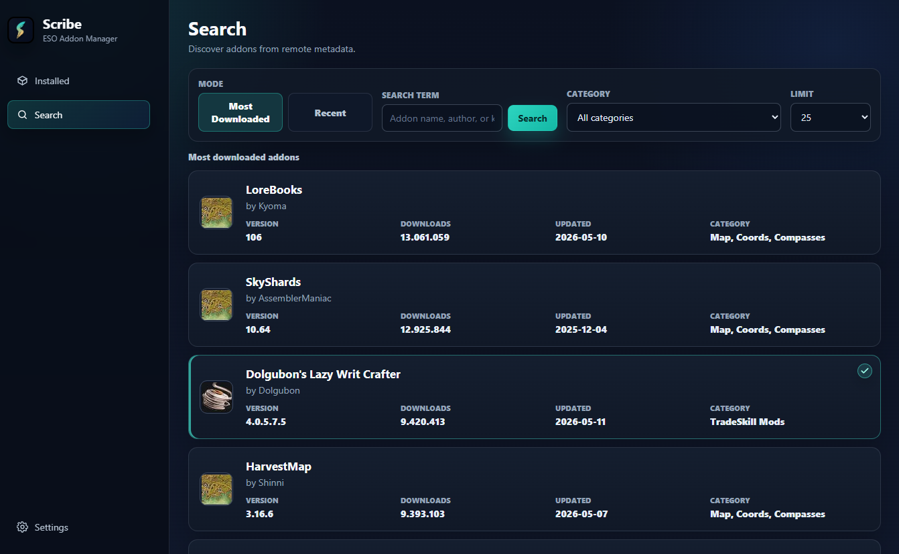
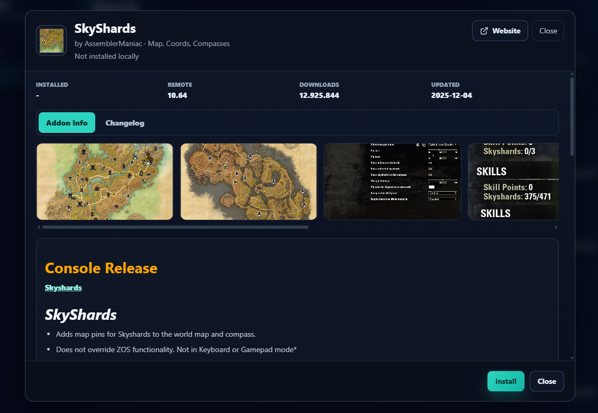
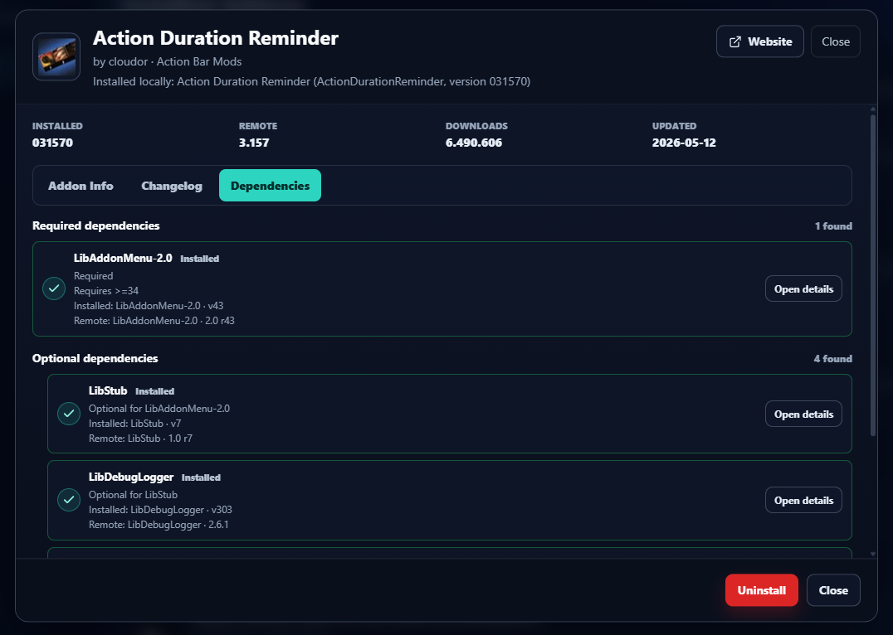

A desktop addon manager for The Elder Scrolls Online, focused on safe addon installation, updates, dependency handling, and local addon management.

## Screenshots

<p>
  
  
  
</p>

## Features

- Browse addons by most downloaded, recent, category, and search query.
- Update individual addons or all detected reliable update candidates.
- Dependency handling; Detect required dependencies and install them when they can be resolved safely.
- Show required and optional dependencies in the Dependencies tab.
- Uninstall installed addons.
- Optionally remove matching SavedVariables during uninstall.
- Clear matching SavedVariables for an installed addon without uninstalling it.
- Create manual compressed backups, optionally including SavedVariables.
- Inspect and restore Scribe backup ZIP files.
- Cache HTTP metadata and remote images.
- Import or adopt existing local addons for more reliable future update checks.
- Resolve remote matches for manually installed or ambiguous local addons.
- Addon details, screenshots, description and changelog look similar to the website.

## Installation

### Download

Get the latest release from GitHub Releases:

`https://github.com/xry1ch/Scribe-Addon-Manager/releases`

Download the installer or executable for your platform, then run the app.

### From Source

Requirements:

- Rust stable
- Node.js and npm
- Tauri prerequisites for your operating system

Clone and run the desktop app:

```bash
git clone https://github.com/xry1ch/Scribe-Addon-Manager.git
cd Scribe-Addon-Manager
npm install
npm run tauri -- dev
```

Build a release package:

```bash
npm run build
npm run tauri -- build
```

## Basic Usage

1. Start Scribe Addon Manager.
2. Confirm or select your ESO `AddOns` folder. On Windows this is usually under `Documents\Elder Scrolls Online\live\AddOns`.
3. Use Installed to review local addons, update candidates, dependencies, and unmatched addons.
4. Use Search to browse addons and open addon details.
5. Review the install or update preview before confirming changes.
6. Configure a backup folder in Settings before large update or reinstall work.

On first setup, Scribe can import existing addon matches as the current baseline. This helps prevent already-installed addons from being treated as unmanaged when checking for future updates.

## Development

Install dependencies:

```bash
npm install
```

Run the Tauri development app:

```bash
npm run tauri -- dev
```

Run frontend checks:

```bash
npm run build
npm run test:bbcode
npm run test:filters
```

Run Rust checks and tests:

```bash
cargo fmt --check
cargo test
cargo test --manifest-path src-tauri/Cargo.toml
```

## License

Scribe Addon Manager is licensed under `GPL-3.0-only`. See [LICENSE](LICENSE).
